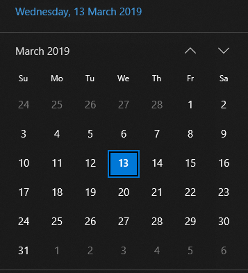

# Calendar Control
## Component
The calendar custom control presents a familiar standard calendar view to the user. Similar to the below windows example.
  

## Examples
### Bare Calendar
```html
<pragma-calendar></pragma-calendar>
```
### Selection on Calendar
```html
  <pragma-calendar>
    <calendar-selection date="@today" />
  </pragma-calendar>
```

### Range Selection on Calendar
```html
  <pragma-calendar>
    <calendar-range-selection start-date="@RangeStart" end-date="@rangeEnd"/>
  </pragma-calendar>
```
## Base Calendar properties

1. What year are you looking at
1. What month are you looking at
1. What format is that year shown as: "Jan", "January"
1. Allow the change of what year you are looking at
1. Allow the change of what month you are looking at

### Api Required

1. Event to notify that calendar display changed.
1. Give me the cell for a given date, null if not in view


## Requirements
- The component will be responsible for its own rendering of the calendar with its associated days.
- The component will make use of a well defined data structure which drives the view.
- Additional features such as day highlighting or range highlighting etc. will be implemented as separate custom elements which are added as features onto the calendar control. Therefore to extend functionality of the calendar you will just add additional custom elements.
- A list of attributes will be made available which allows control over the base features of the calendar, for example weeks starts on 'Monday/Sunday' or grid layout or list layout view.
- The calendar must support click events and range selections.
- The cell contents of the days must be customizable.
- The calendar control must emit expected events such as "DateSelected","RangeSelected" etc..
- As part of its encapsulation of logic the calendar must understand how to do functions like "MoveNextMonth","GetCurrentDay","GetCurrentRange","SetRange" etc..
- The calendar component must expose the correct accessability tree.
- Keyboard bindings must be available.
## Design
### Data Structure
```Json

```
### InVision
[InVision Date Control Design](https://projects.invisionapp.com/d/main#/projects/prototypes/16778341)
## Accessability
Look at other calendar implementations for the accessability tree.
## Keyboard
todo